```python
import pandas as pd
```

# 주식데이터 불러오기


```python
def stock_data(fname):
    stock = pd.read_excel(fname)
    
    
    stock.dropna(axis=0, how ='any', inplace=True) # 시장 문 닫은 주말 제거
    
    company_name = list(set(stock.회사이름)) # 회사이름 획득.
    
    stock_anal = stock[['날짜','종가','회사이름','업종']] # 필요한 변수
    stock_date = [i.replace('.','') for i in stock_anal['날짜'].tolist()] # 날짜 변수 전처리
    
    stock_anal['날짜'] = stock_date
    
    stock_anal.reset_index(drop=True, inplace=True)
    
    return stock_anal
```


```python
stock_anal = stock_data('주식 시세_최종.xlsx') # 주식 데이터 불러오기. 실행.
```

    C:\Users\user\anaconda3\lib\site-packages\ipykernel_launcher.py:12: SettingWithCopyWarning: 
    A value is trying to be set on a copy of a slice from a DataFrame.
    Try using .loc[row_indexer,col_indexer] = value instead
    
    See the caveats in the documentation: https://pandas.pydata.org/pandas-docs/stable/user_guide/indexing.html#returning-a-view-versus-a-copy
      if sys.path[0] == '':
    


```python
stock_anal.head() # 불러온 결과.
```


<div>
<style scoped>
    .dataframe tbody tr th:only-of-type {
        vertical-align: middle;
    }

    .dataframe tbody tr th {
        vertical-align: top;
    }

    .dataframe thead th {
        text-align: right;
    }
</style>
<table border="1" class="dataframe">
  <thead>
    <tr style="text-align: right;">
      <th></th>
      <th>날짜</th>
      <th>종가</th>
      <th>회사이름</th>
      <th>업종</th>
    </tr>
  </thead>
  <tbody>
    <tr>
      <th>0</th>
      <td>20200612</td>
      <td>52300.0</td>
      <td>삼성전자</td>
      <td>반도체와반도체장비</td>
    </tr>
    <tr>
      <th>1</th>
      <td>20200611</td>
      <td>54300.0</td>
      <td>삼성전자</td>
      <td>반도체와반도체장비</td>
    </tr>
    <tr>
      <th>2</th>
      <td>20200610</td>
      <td>55400.0</td>
      <td>삼성전자</td>
      <td>반도체와반도체장비</td>
    </tr>
    <tr>
      <th>3</th>
      <td>20200609</td>
      <td>55500.0</td>
      <td>삼성전자</td>
      <td>반도체와반도체장비</td>
    </tr>
    <tr>
      <th>4</th>
      <td>20200608</td>
      <td>54900.0</td>
      <td>삼성전자</td>
      <td>반도체와반도체장비</td>
    </tr>
  </tbody>
</table>
</div>


```python

```

# 코로나 데이터 불러오기


```python
def corona_data(fname):
    corona=pd.read_csv(fname, encoding='cp949')
    
    corona = pd.pivot_table(data=corona, index='date', columns='region',values='confirmed') #피벗테이블
    
    corona["확진자"]=corona.sum(axis=1) # 전국 확진자 합계
    
    # 필요한 변수
    corona=corona[['확진자']]
    corona['날짜'] = [str(i) for i in corona.index]
    
    return corona
```


```python
corona = corona_data('코로나 발생.txt') # 코로나 데이터 불러오기. 실행.
```


```python
corona.head() #불러온 결과
```


<div>
<style scoped>
    .dataframe tbody tr th:only-of-type {
        vertical-align: middle;
    }

    .dataframe tbody tr th {
        vertical-align: top;
    }

    .dataframe thead th {
        text-align: right;
    }
</style>
<table border="1" class="dataframe">
  <thead>
    <tr style="text-align: right;">
      <th>region</th>
      <th>확진자</th>
      <th>날짜</th>
    </tr>
    <tr>
      <th>date</th>
      <th></th>
      <th></th>
    </tr>
  </thead>
  <tbody>
    <tr>
      <th>20200217</th>
      <td>30</td>
      <td>20200217</td>
    </tr>
    <tr>
      <th>20200218</th>
      <td>31</td>
      <td>20200218</td>
    </tr>
    <tr>
      <th>20200219</th>
      <td>51</td>
      <td>20200219</td>
    </tr>
    <tr>
      <th>20200220</th>
      <td>108</td>
      <td>20200220</td>
    </tr>
    <tr>
      <th>20200221</th>
      <td>205</td>
      <td>20200221</td>
    </tr>
  </tbody>
</table>
</div>


# 코로나+주식 데이터 병합


```python
def combine(corona, stock):
    stock_corona = pd.merge(left=stock, right=corona, on='날짜') # 병합
    
    stock_corona.sort_values(by=['회사이름','날짜'],ascending=True, inplace=True) # 정렬
    
    return stock_corona
```


```python
stock_corona = combine(corona, stock_anal) # 데이터 병합하기.
```


```python
stock_corona.head() # 실행결과.
```


<div>
<style scoped>
    .dataframe tbody tr th:only-of-type {
        vertical-align: middle;
    }

    .dataframe tbody tr th {
        vertical-align: top;
    }

    .dataframe thead th {
        text-align: right;
    }
</style>
<table border="1" class="dataframe">
  <thead>
    <tr style="text-align: right;">
      <th></th>
      <th>날짜</th>
      <th>종가</th>
      <th>회사이름</th>
      <th>업종</th>
      <th>확진자</th>
    </tr>
  </thead>
  <tbody>
    <tr>
      <th>125040</th>
      <td>20200217</td>
      <td>4920.0</td>
      <td>AJ네트웍스</td>
      <td>도로와철도운송</td>
      <td>30</td>
    </tr>
    <tr>
      <th>123494</th>
      <td>20200218</td>
      <td>4965.0</td>
      <td>AJ네트웍스</td>
      <td>도로와철도운송</td>
      <td>31</td>
    </tr>
    <tr>
      <th>121948</th>
      <td>20200219</td>
      <td>4905.0</td>
      <td>AJ네트웍스</td>
      <td>도로와철도운송</td>
      <td>51</td>
    </tr>
    <tr>
      <th>120402</th>
      <td>20200220</td>
      <td>4855.0</td>
      <td>AJ네트웍스</td>
      <td>도로와철도운송</td>
      <td>108</td>
    </tr>
    <tr>
      <th>118856</th>
      <td>20200221</td>
      <td>4840.0</td>
      <td>AJ네트웍스</td>
      <td>도로와철도운송</td>
      <td>205</td>
    </tr>
  </tbody>
</table>
</div>


# 상관계수


```python
company_name=list(set(stock_corona['회사이름'].tolist())) # 회사이름 명단.

def correlation(data):
    n=[]
    c=[]
    for i in company_name[:]:
        tmp = data[data['회사이름'].apply(lambda x: x==i)].reset_index(drop=True)
        c.append(tmp[['확진자','종가']].corr().iloc[1,0])
        n.append(i)
        
    result = pd.DataFrame([n,c]).T
    
    result.columns = ['회사이름','상관계수']
    
    result = result.sort_values(by=['상관계수'], ascending=False).reset_index(drop=True)
    
    return result
```


```python
result=correlation(stock_corona)# 실행결과
```


```python
result_domain=pd.merge(left=result, right=stock_corona[['회사이름','업종']].drop_duplicates(), on='회사이름')
```

#### <span style='background:orange'>  '회사이름', '업종', '상관계수' 엑셀 파일 저장


```python
result_domain.to_excel('주식_코로나_상관계수.xlsx')
```

# 코로나 확진자 현황 그래프


```python
# 한글깨짐을 위한 기본세팅
import matplotlib.pyplot as plt
from matplotlib import font_manager, rc

font_name = font_manager.FontProperties(fname="c:/Windows/Fonts/malgun.ttf").get_name()
rc('font', family=font_name)
plt.rcParams['axes.unicode_minus'] = False

plt.rcParams['figure.figsize'] = (15,7)
```

#### 누적 확진자 그래프 


```python
plt.plot(range(len(corona)), corona.확진자, color='hotpink')
plt.title('확진자 현황', ) # 제목 붙이기
plt.ylabel('확진자 수')

frame = plt.gca()
frame.axes.get_xaxis().set_visible(False)

plt.text(-3,900,'신천지 2/17', fontsize=13, color='r')
plt.text(-5,-1000,'2월 17일', fontsize=13)
plt.text(18,-1000,'3월', fontsize=13)
plt.text(48,-1000,'4월', fontsize=13)
plt.text(78,-1000,'5월', fontsize=13)
plt.text(16,8100,'콜센터 3/9', fontsize=13, color='r')
plt.text(77,11200,'이태원 5/7', fontsize=13, color='r')
plt.text(97,11700,'쿠팡 5/27', fontsize=13, color='r')
plt.text(115,-1000,'6월 15일', fontsize=13)


```


    Text(115, -1000, '6월 15일')


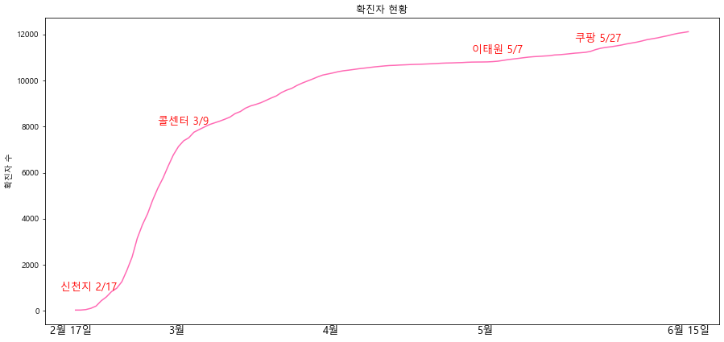


# 상관관계가 있는 회사들 살펴보기


```python
domain = list(set(result_domain.업종)) # 업종 리스트.
```


```python
# 업종이 없거나, 상장폐지된 회사 제외.
import math
pre = result_domain[result_domain['업종'].apply(lambda x: x != '없종없음')] # 업종없는 회사 제외
pre = pre[pre['상관계수'].apply(lambda k: math.isnan(k) == False)].reset_index(drop=True)# 거래정지된 회사 제외
```

 #### <span style='background:orange'> 상관계수 0.4를 기준으로 양/음의 상관관계가 있음을 기준으로 함


```python
positive = pre[pre['상관계수'].apply(lambda x: x >= 0.4)]
negative = pre[pre['상관계수'].apply(lambda x: x <= -0.4)]
```

### 양의 상관관계가 있는 회사


```python
from collections import Counter

tmp=pd.DataFrame([dict(Counter(positive.업종)).keys(), dict(Counter(positive.업종)).values()]).T
tmp.columns=['업종','개수']
tmp.sort_values(by='개수', ascending=False, inplace=True)
tmp.reset_index(drop=True, inplace=True)

bar=plt.bar(tmp.업종, tmp.개수, color='skyblue')
bar[0].set_color('hotpink')
bar[1].set_color('pink')

plt.xticks(rotation=45)
plt.xlim(-1,10.5)

plt.title('양의 상관관계를 가진 상위 업종')
plt.ylabel('개수')
plt.xlabel('업종')
```


    Text(0.5, 0, '업종')


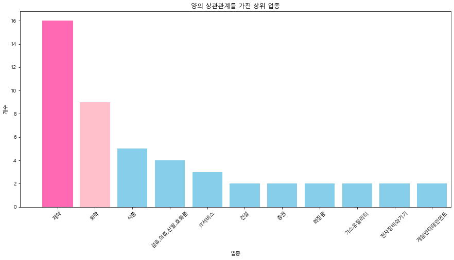


#### <span style='background:yellow'> 양의 상관관계를 가진 제약회사


```python
tmp = pre[pre['업종'].apply(lambda x: x=='제약')]
tmp[tmp['상관계수']>=0.4]
```


<div>
<style scoped>
    .dataframe tbody tr th:only-of-type {
        vertical-align: middle;
    }

    .dataframe tbody tr th {
        vertical-align: top;
    }

    .dataframe thead th {
        text-align: right;
    }
</style>
<table border="1" class="dataframe">
  <thead>
    <tr style="text-align: right;">
      <th></th>
      <th>회사이름</th>
      <th>상관계수</th>
      <th>업종</th>
    </tr>
  </thead>
  <tbody>
    <tr>
      <th>2</th>
      <td>부광약품</td>
      <td>0.813778</td>
      <td>제약</td>
    </tr>
    <tr>
      <th>7</th>
      <td>녹십자</td>
      <td>0.755467</td>
      <td>제약</td>
    </tr>
    <tr>
      <th>8</th>
      <td>신풍제약</td>
      <td>0.747607</td>
      <td>제약</td>
    </tr>
    <tr>
      <th>10</th>
      <td>신풍제약우</td>
      <td>0.711117</td>
      <td>제약</td>
    </tr>
    <tr>
      <th>19</th>
      <td>셀트리온</td>
      <td>0.627518</td>
      <td>제약</td>
    </tr>
    <tr>
      <th>25</th>
      <td>일양약품</td>
      <td>0.589825</td>
      <td>제약</td>
    </tr>
    <tr>
      <th>26</th>
      <td>녹십자홀딩스</td>
      <td>0.584558</td>
      <td>제약</td>
    </tr>
    <tr>
      <th>33</th>
      <td>삼성바이오로직스</td>
      <td>0.529724</td>
      <td>제약</td>
    </tr>
    <tr>
      <th>34</th>
      <td>JW중외제약</td>
      <td>0.521294</td>
      <td>제약</td>
    </tr>
    <tr>
      <th>36</th>
      <td>동화약품</td>
      <td>0.516215</td>
      <td>제약</td>
    </tr>
    <tr>
      <th>38</th>
      <td>대웅</td>
      <td>0.5075</td>
      <td>제약</td>
    </tr>
    <tr>
      <th>39</th>
      <td>에이프로젠제약</td>
      <td>0.506129</td>
      <td>제약</td>
    </tr>
    <tr>
      <th>44</th>
      <td>명문제약</td>
      <td>0.493874</td>
      <td>제약</td>
    </tr>
    <tr>
      <th>45</th>
      <td>코스맥스비티아이</td>
      <td>0.48552</td>
      <td>제약</td>
    </tr>
    <tr>
      <th>53</th>
      <td>국제약품</td>
      <td>0.458542</td>
      <td>제약</td>
    </tr>
    <tr>
      <th>71</th>
      <td>유나이티드제약</td>
      <td>0.404867</td>
      <td>제약</td>
    </tr>
  </tbody>
</table>
</div>


```python
tmp = pre[pre['업종'].apply(lambda x: x=='제약')]
tmp
```


<div>
<style scoped>
    .dataframe tbody tr th:only-of-type {
        vertical-align: middle;
    }

    .dataframe tbody tr th {
        vertical-align: top;
    }

    .dataframe thead th {
        text-align: right;
    }
</style>
<table border="1" class="dataframe">
  <thead>
    <tr style="text-align: right;">
      <th></th>
      <th>회사이름</th>
      <th>상관계수</th>
      <th>업종</th>
    </tr>
  </thead>
  <tbody>
    <tr>
      <th>2</th>
      <td>부광약품</td>
      <td>0.813778</td>
      <td>제약</td>
    </tr>
    <tr>
      <th>7</th>
      <td>녹십자</td>
      <td>0.755467</td>
      <td>제약</td>
    </tr>
    <tr>
      <th>8</th>
      <td>신풍제약</td>
      <td>0.747607</td>
      <td>제약</td>
    </tr>
    <tr>
      <th>10</th>
      <td>신풍제약우</td>
      <td>0.711117</td>
      <td>제약</td>
    </tr>
    <tr>
      <th>19</th>
      <td>셀트리온</td>
      <td>0.627518</td>
      <td>제약</td>
    </tr>
    <tr>
      <th>25</th>
      <td>일양약품</td>
      <td>0.589825</td>
      <td>제약</td>
    </tr>
    <tr>
      <th>26</th>
      <td>녹십자홀딩스</td>
      <td>0.584558</td>
      <td>제약</td>
    </tr>
    <tr>
      <th>33</th>
      <td>삼성바이오로직스</td>
      <td>0.529724</td>
      <td>제약</td>
    </tr>
    <tr>
      <th>34</th>
      <td>JW중외제약</td>
      <td>0.521294</td>
      <td>제약</td>
    </tr>
    <tr>
      <th>36</th>
      <td>동화약품</td>
      <td>0.516215</td>
      <td>제약</td>
    </tr>
    <tr>
      <th>38</th>
      <td>대웅</td>
      <td>0.5075</td>
      <td>제약</td>
    </tr>
    <tr>
      <th>39</th>
      <td>에이프로젠제약</td>
      <td>0.506129</td>
      <td>제약</td>
    </tr>
    <tr>
      <th>44</th>
      <td>명문제약</td>
      <td>0.493874</td>
      <td>제약</td>
    </tr>
    <tr>
      <th>45</th>
      <td>코스맥스비티아이</td>
      <td>0.48552</td>
      <td>제약</td>
    </tr>
    <tr>
      <th>53</th>
      <td>국제약품</td>
      <td>0.458542</td>
      <td>제약</td>
    </tr>
    <tr>
      <th>71</th>
      <td>유나이티드제약</td>
      <td>0.404867</td>
      <td>제약</td>
    </tr>
    <tr>
      <th>77</th>
      <td>우리들제약</td>
      <td>0.385499</td>
      <td>제약</td>
    </tr>
    <tr>
      <th>117</th>
      <td>일양약품우</td>
      <td>0.312458</td>
      <td>제약</td>
    </tr>
    <tr>
      <th>123</th>
      <td>종근당홀딩스</td>
      <td>0.299223</td>
      <td>제약</td>
    </tr>
    <tr>
      <th>128</th>
      <td>보령제약</td>
      <td>0.288117</td>
      <td>제약</td>
    </tr>
    <tr>
      <th>148</th>
      <td>광동제약</td>
      <td>0.243531</td>
      <td>제약</td>
    </tr>
    <tr>
      <th>149</th>
      <td>제일약품</td>
      <td>0.240226</td>
      <td>제약</td>
    </tr>
    <tr>
      <th>156</th>
      <td>종근당</td>
      <td>0.23392</td>
      <td>제약</td>
    </tr>
    <tr>
      <th>159</th>
      <td>삼성제약</td>
      <td>0.229394</td>
      <td>제약</td>
    </tr>
    <tr>
      <th>160</th>
      <td>삼진제약</td>
      <td>0.229376</td>
      <td>제약</td>
    </tr>
    <tr>
      <th>173</th>
      <td>유유제약1우</td>
      <td>0.208067</td>
      <td>제약</td>
    </tr>
    <tr>
      <th>175</th>
      <td>유유제약</td>
      <td>0.205698</td>
      <td>제약</td>
    </tr>
    <tr>
      <th>183</th>
      <td>제일파마홀딩스</td>
      <td>0.198572</td>
      <td>제약</td>
    </tr>
    <tr>
      <th>185</th>
      <td>대원제약</td>
      <td>0.19563</td>
      <td>제약</td>
    </tr>
    <tr>
      <th>186</th>
      <td>한올바이오파마</td>
      <td>0.195302</td>
      <td>제약</td>
    </tr>
    <tr>
      <th>197</th>
      <td>한독</td>
      <td>0.178803</td>
      <td>제약</td>
    </tr>
    <tr>
      <th>218</th>
      <td>동아쏘시오홀딩스</td>
      <td>0.148357</td>
      <td>제약</td>
    </tr>
    <tr>
      <th>225</th>
      <td>유유제약2우B</td>
      <td>0.135081</td>
      <td>제약</td>
    </tr>
    <tr>
      <th>248</th>
      <td>녹십자홀딩스2우</td>
      <td>0.0982098</td>
      <td>제약</td>
    </tr>
    <tr>
      <th>253</th>
      <td>이연제약</td>
      <td>0.0866357</td>
      <td>제약</td>
    </tr>
    <tr>
      <th>270</th>
      <td>현대약품</td>
      <td>0.0555283</td>
      <td>제약</td>
    </tr>
    <tr>
      <th>272</th>
      <td>JW중외제약우</td>
      <td>0.0541157</td>
      <td>제약</td>
    </tr>
    <tr>
      <th>302</th>
      <td>JW생명과학</td>
      <td>0.0120006</td>
      <td>제약</td>
    </tr>
    <tr>
      <th>303</th>
      <td>환인제약</td>
      <td>0.0102691</td>
      <td>제약</td>
    </tr>
    <tr>
      <th>308</th>
      <td>하나제약</td>
      <td>0.00156575</td>
      <td>제약</td>
    </tr>
    <tr>
      <th>309</th>
      <td>경보제약</td>
      <td>0.000602759</td>
      <td>제약</td>
    </tr>
    <tr>
      <th>310</th>
      <td>일성신약</td>
      <td>0.000483132</td>
      <td>제약</td>
    </tr>
    <tr>
      <th>311</th>
      <td>삼일제약</td>
      <td>-0.00118002</td>
      <td>제약</td>
    </tr>
    <tr>
      <th>314</th>
      <td>영진약품</td>
      <td>-0.00344449</td>
      <td>제약</td>
    </tr>
    <tr>
      <th>325</th>
      <td>대웅제약</td>
      <td>-0.0210886</td>
      <td>제약</td>
    </tr>
    <tr>
      <th>360</th>
      <td>JW중외제약2우B</td>
      <td>-0.0589085</td>
      <td>제약</td>
    </tr>
    <tr>
      <th>365</th>
      <td>동성제약</td>
      <td>-0.0676966</td>
      <td>제약</td>
    </tr>
    <tr>
      <th>390</th>
      <td>종근당바이오</td>
      <td>-0.116472</td>
      <td>제약</td>
    </tr>
    <tr>
      <th>431</th>
      <td>동아에스티</td>
      <td>-0.15729</td>
      <td>제약</td>
    </tr>
    <tr>
      <th>498</th>
      <td>JW홀딩스</td>
      <td>-0.218893</td>
      <td>제약</td>
    </tr>
    <tr>
      <th>529</th>
      <td>일동제약</td>
      <td>-0.262968</td>
      <td>제약</td>
    </tr>
    <tr>
      <th>581</th>
      <td>한미사이언스</td>
      <td>-0.332412</td>
      <td>제약</td>
    </tr>
    <tr>
      <th>642</th>
      <td>일동홀딩스</td>
      <td>-0.407097</td>
      <td>제약</td>
    </tr>
    <tr>
      <th>697</th>
      <td>한미약품</td>
      <td>-0.473553</td>
      <td>제약</td>
    </tr>
    <tr>
      <th>833</th>
      <td>유한양행우</td>
      <td>-0.685395</td>
      <td>제약</td>
    </tr>
    <tr>
      <th>837</th>
      <td>유한양행</td>
      <td>-0.693874</td>
      <td>제약</td>
    </tr>
  </tbody>
</table>
</div>


#### <span style='background:yellow'> 양의 상관관계를 가진 화학회사


```python
tmp = pre[pre['업종'].apply(lambda x: x=='화학')]
tmp[tmp['상관계수']>=0.4]
```


<div>
<style scoped>
    .dataframe tbody tr th:only-of-type {
        vertical-align: middle;
    }

    .dataframe tbody tr th {
        vertical-align: top;
    }

    .dataframe thead th {
        text-align: right;
    }
</style>
<table border="1" class="dataframe">
  <thead>
    <tr style="text-align: right;">
      <th></th>
      <th>회사이름</th>
      <th>상관계수</th>
      <th>업종</th>
    </tr>
  </thead>
  <tbody>
    <tr>
      <th>1</th>
      <td>파미셀</td>
      <td>0.820334</td>
      <td>화학</td>
    </tr>
    <tr>
      <th>13</th>
      <td>미원에스씨</td>
      <td>0.693412</td>
      <td>화학</td>
    </tr>
    <tr>
      <th>14</th>
      <td>동남합성</td>
      <td>0.687544</td>
      <td>화학</td>
    </tr>
    <tr>
      <th>15</th>
      <td>SK케미칼</td>
      <td>0.686482</td>
      <td>화학</td>
    </tr>
    <tr>
      <th>35</th>
      <td>미원상사</td>
      <td>0.518877</td>
      <td>화학</td>
    </tr>
    <tr>
      <th>40</th>
      <td>대한유화</td>
      <td>0.503017</td>
      <td>화학</td>
    </tr>
    <tr>
      <th>57</th>
      <td>미원홀딩스</td>
      <td>0.446974</td>
      <td>화학</td>
    </tr>
    <tr>
      <th>65</th>
      <td>경농</td>
      <td>0.414391</td>
      <td>화학</td>
    </tr>
    <tr>
      <th>66</th>
      <td>SK케미칼우</td>
      <td>0.414033</td>
      <td>화학</td>
    </tr>
  </tbody>
</table>
</div>


### 양의 상관관계가 가장 높은 제약회사들과 확진자수 그래프


```python
p1=stock_anal[stock_anal['회사이름']=='부광약품'].sort_values(by='날짜',ascending=True)
p2=stock_anal[stock_anal['회사이름']=='녹십자'].sort_values(by='날짜',ascending=True)
p3=stock_anal[stock_anal['회사이름']=='신풍제약'].sort_values(by='날짜',ascending=True)
p4=stock_anal[stock_anal['회사이름']=='셀트리온'].sort_values(by='날짜',ascending=True)
p5=stock_anal[stock_anal['회사이름']=='일양약품'].sort_values(by='날짜',ascending=True)
k1=corona
```


```python
from sklearn import preprocessing
import numpy as np
def standard(data, column):
    x_array = np.array(data[column])
    stand = preprocessing.normalize([x_array])
    return stand[0]

p1['standard']=standard(p1,'종가')
p2['standard']=standard(p2,'종가')
p3['standard']=standard(p3,'종가')
p4['standard']=standard(p4,'종가')
p5['standard']=standard(p5,'종가')
k1['standard']=standard(k1,'확진자')

```


```python
plt.plot(range(120), p1.standard)
plt.plot(range(120), p2.standard)
plt.plot(range(120), p3.standard)
plt.plot(range(120), p4.standard)
plt.plot(range(120), p5.standard)
plt.plot(range(120), k1.standard)

plt.legend(['부광약품','녹십자','신풍제약','셀트리온','일양약품','확진자'])
plt.axvline(x=0, ymin=0, ymax=1, color='hotpink',linestyle='--')
plt.axvline(x=20, ymin=0, ymax=1, color='hotpink',linestyle='--')
plt.axvline(x=79, ymin=0, ymax=1, color='hotpink',linestyle='--')
plt.axvline(x=99, ymin=0, ymax=1, color='hotpink',linestyle='--')


```


    <matplotlib.lines.Line2D at 0x232bf67f948>


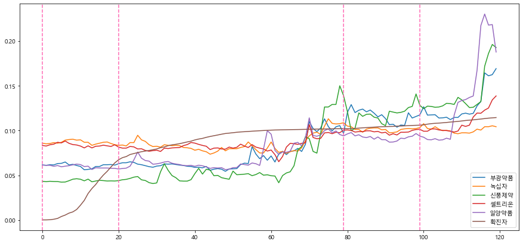


### 음의 상관관계가 있는 회사


```python
from collections import Counter

tmp=pd.DataFrame([dict(Counter(negative.업종)).keys(), dict(Counter(negative.업종)).values()]).T
tmp.columns=['업종','개수']
tmp.sort_values(by='개수', ascending=False, inplace=True)
tmp.reset_index(drop=True, inplace=True)

bar=plt.bar(tmp.업종, tmp.개수, color='skyblue')
bar[0].set_color('hotpink')
bar[1].set_color('pink')

plt.xticks(rotation=45)
plt.xlim(-1,10.5)

plt.title('음의 상관관계를 가진 상위 업종')
plt.ylabel('개수')
plt.xlabel('업종')
```


    Text(0.5, 0, '업종')


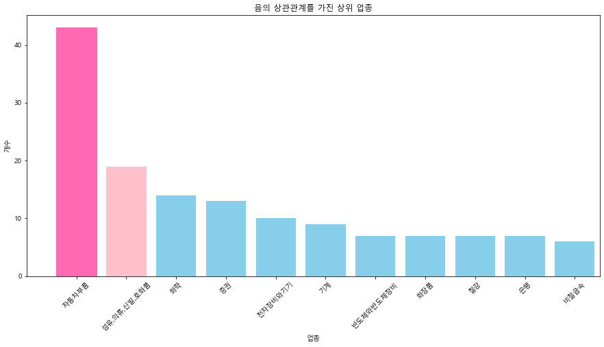


#### <span style='background:yellow'> 음의 상관관계를 가진 자동차부품 회사


```python
tmp = pre[pre['업종'].apply(lambda x: x=='자동차부품')]
tmp[tmp['상관계수']<=-0.4]
```


<div>
<style scoped>
    .dataframe tbody tr th:only-of-type {
        vertical-align: middle;
    }

    .dataframe tbody tr th {
        vertical-align: top;
    }

    .dataframe thead th {
        text-align: right;
    }
</style>
<table border="1" class="dataframe">
  <thead>
    <tr style="text-align: right;">
      <th></th>
      <th>회사이름</th>
      <th>상관계수</th>
      <th>업종</th>
    </tr>
  </thead>
  <tbody>
    <tr>
      <th>646</th>
      <td>태양금속</td>
      <td>-0.418042</td>
      <td>자동차부품</td>
    </tr>
    <tr>
      <th>660</th>
      <td>인지컨트롤스</td>
      <td>-0.432898</td>
      <td>자동차부품</td>
    </tr>
    <tr>
      <th>661</th>
      <td>SG충방</td>
      <td>-0.433036</td>
      <td>자동차부품</td>
    </tr>
    <tr>
      <th>677</th>
      <td>태양금속우</td>
      <td>-0.448678</td>
      <td>자동차부품</td>
    </tr>
    <tr>
      <th>707</th>
      <td>지엠비코리아</td>
      <td>-0.485607</td>
      <td>자동차부품</td>
    </tr>
    <tr>
      <th>711</th>
      <td>지코</td>
      <td>-0.491705</td>
      <td>자동차부품</td>
    </tr>
    <tr>
      <th>717</th>
      <td>넥센타이어</td>
      <td>-0.506425</td>
      <td>자동차부품</td>
    </tr>
    <tr>
      <th>719</th>
      <td>현대모비스</td>
      <td>-0.507836</td>
      <td>자동차부품</td>
    </tr>
    <tr>
      <th>720</th>
      <td>SJM</td>
      <td>-0.507934</td>
      <td>자동차부품</td>
    </tr>
    <tr>
      <th>726</th>
      <td>에스엘</td>
      <td>-0.513953</td>
      <td>자동차부품</td>
    </tr>
    <tr>
      <th>731</th>
      <td>모토닉</td>
      <td>-0.523215</td>
      <td>자동차부품</td>
    </tr>
    <tr>
      <th>734</th>
      <td>한국타이어앤테크놀로지</td>
      <td>-0.526855</td>
      <td>자동차부품</td>
    </tr>
    <tr>
      <th>736</th>
      <td>세방전지</td>
      <td>-0.532357</td>
      <td>자동차부품</td>
    </tr>
    <tr>
      <th>742</th>
      <td>대유플러스</td>
      <td>-0.53884</td>
      <td>자동차부품</td>
    </tr>
    <tr>
      <th>749</th>
      <td>SJM홀딩스</td>
      <td>-0.549859</td>
      <td>자동차부품</td>
    </tr>
    <tr>
      <th>752</th>
      <td>대원강업</td>
      <td>-0.554362</td>
      <td>자동차부품</td>
    </tr>
    <tr>
      <th>755</th>
      <td>태원물산</td>
      <td>-0.55693</td>
      <td>자동차부품</td>
    </tr>
    <tr>
      <th>765</th>
      <td>서연이화</td>
      <td>-0.574887</td>
      <td>자동차부품</td>
    </tr>
    <tr>
      <th>769</th>
      <td>한라홀딩스</td>
      <td>-0.580275</td>
      <td>자동차부품</td>
    </tr>
    <tr>
      <th>774</th>
      <td>동양피스톤</td>
      <td>-0.590913</td>
      <td>자동차부품</td>
    </tr>
    <tr>
      <th>775</th>
      <td>덕양산업</td>
      <td>-0.591505</td>
      <td>자동차부품</td>
    </tr>
    <tr>
      <th>779</th>
      <td>케이비아이동국실업</td>
      <td>-0.59301</td>
      <td>자동차부품</td>
    </tr>
    <tr>
      <th>798</th>
      <td>동원금속</td>
      <td>-0.618861</td>
      <td>자동차부품</td>
    </tr>
    <tr>
      <th>801</th>
      <td>넥센</td>
      <td>-0.625425</td>
      <td>자동차부품</td>
    </tr>
    <tr>
      <th>803</th>
      <td>넥센타이어1우B</td>
      <td>-0.633401</td>
      <td>자동차부품</td>
    </tr>
    <tr>
      <th>806</th>
      <td>만도</td>
      <td>-0.636147</td>
      <td>자동차부품</td>
    </tr>
    <tr>
      <th>808</th>
      <td>S&amp;T중공업</td>
      <td>-0.644131</td>
      <td>자동차부품</td>
    </tr>
    <tr>
      <th>812</th>
      <td>삼성공조</td>
      <td>-0.651363</td>
      <td>자동차부품</td>
    </tr>
    <tr>
      <th>814</th>
      <td>디티알오토모티브</td>
      <td>-0.654559</td>
      <td>자동차부품</td>
    </tr>
    <tr>
      <th>824</th>
      <td>한온시스템</td>
      <td>-0.667559</td>
      <td>자동차부품</td>
    </tr>
    <tr>
      <th>825</th>
      <td>핸즈코퍼레이션</td>
      <td>-0.667772</td>
      <td>자동차부품</td>
    </tr>
    <tr>
      <th>826</th>
      <td>삼원강재</td>
      <td>-0.670846</td>
      <td>자동차부품</td>
    </tr>
    <tr>
      <th>835</th>
      <td>한국테크놀로지그룹</td>
      <td>-0.685871</td>
      <td>자동차부품</td>
    </tr>
    <tr>
      <th>840</th>
      <td>넥센우</td>
      <td>-0.697447</td>
      <td>자동차부품</td>
    </tr>
    <tr>
      <th>852</th>
      <td>티에이치엔</td>
      <td>-0.729775</td>
      <td>자동차부품</td>
    </tr>
    <tr>
      <th>853</th>
      <td>대유에이텍</td>
      <td>-0.733016</td>
      <td>자동차부품</td>
    </tr>
    <tr>
      <th>854</th>
      <td>화승알앤에이</td>
      <td>-0.733429</td>
      <td>자동차부품</td>
    </tr>
    <tr>
      <th>858</th>
      <td>화신</td>
      <td>-0.74638</td>
      <td>자동차부품</td>
    </tr>
    <tr>
      <th>859</th>
      <td>상신브레이크</td>
      <td>-0.746544</td>
      <td>자동차부품</td>
    </tr>
    <tr>
      <th>862</th>
      <td>새론오토모티브</td>
      <td>-0.768981</td>
      <td>자동차부품</td>
    </tr>
    <tr>
      <th>882</th>
      <td>금호타이어</td>
      <td>-0.843485</td>
      <td>자동차부품</td>
    </tr>
    <tr>
      <th>887</th>
      <td>우신시스템</td>
      <td>-0.878281</td>
      <td>자동차부품</td>
    </tr>
    <tr>
      <th>888</th>
      <td>일정실업</td>
      <td>-0.88066</td>
      <td>자동차부품</td>
    </tr>
  </tbody>
</table>
</div>


#### <span style='background:yellow'> 음의 상관관계를 가진 섬유,의류,신발,호화품 회사


```python
tmp = pre[pre['업종'].apply(lambda x: x=='섬유,의류,신발,호화품')]
tmp[tmp['상관계수']<=-0.4]
```


<div>
<style scoped>
    .dataframe tbody tr th:only-of-type {
        vertical-align: middle;
    }

    .dataframe tbody tr th {
        vertical-align: top;
    }

    .dataframe thead th {
        text-align: right;
    }
</style>
<table border="1" class="dataframe">
  <thead>
    <tr style="text-align: right;">
      <th></th>
      <th>회사이름</th>
      <th>상관계수</th>
      <th>업종</th>
    </tr>
  </thead>
  <tbody>
    <tr>
      <th>637</th>
      <td>삼양통상</td>
      <td>-0.402865</td>
      <td>섬유,의류,신발,호화품</td>
    </tr>
    <tr>
      <th>647</th>
      <td>일신방직</td>
      <td>-0.419651</td>
      <td>섬유,의류,신발,호화품</td>
    </tr>
    <tr>
      <th>649</th>
      <td>TBH글로벌</td>
      <td>-0.420171</td>
      <td>섬유,의류,신발,호화품</td>
    </tr>
    <tr>
      <th>656</th>
      <td>신영와코루</td>
      <td>-0.425399</td>
      <td>섬유,의류,신발,호화품</td>
    </tr>
    <tr>
      <th>682</th>
      <td>한세엠케이</td>
      <td>-0.456292</td>
      <td>섬유,의류,신발,호화품</td>
    </tr>
    <tr>
      <th>686</th>
      <td>SG세계물산</td>
      <td>-0.45842</td>
      <td>섬유,의류,신발,호화품</td>
    </tr>
    <tr>
      <th>708</th>
      <td>유니켐</td>
      <td>-0.488342</td>
      <td>섬유,의류,신발,호화품</td>
    </tr>
    <tr>
      <th>733</th>
      <td>백산</td>
      <td>-0.526835</td>
      <td>섬유,의류,신발,호화품</td>
    </tr>
    <tr>
      <th>735</th>
      <td>방림</td>
      <td>-0.529063</td>
      <td>섬유,의류,신발,호화품</td>
    </tr>
    <tr>
      <th>746</th>
      <td>효성티앤씨</td>
      <td>-0.544205</td>
      <td>섬유,의류,신발,호화품</td>
    </tr>
    <tr>
      <th>751</th>
      <td>성안</td>
      <td>-0.552105</td>
      <td>섬유,의류,신발,호화품</td>
    </tr>
    <tr>
      <th>757</th>
      <td>화승엔터프라이즈</td>
      <td>-0.56352</td>
      <td>섬유,의류,신발,호화품</td>
    </tr>
    <tr>
      <th>761</th>
      <td>한세예스24홀딩스</td>
      <td>-0.568895</td>
      <td>섬유,의류,신발,호화품</td>
    </tr>
    <tr>
      <th>780</th>
      <td>대현</td>
      <td>-0.593551</td>
      <td>섬유,의류,신발,호화품</td>
    </tr>
    <tr>
      <th>796</th>
      <td>DI동일</td>
      <td>-0.617692</td>
      <td>섬유,의류,신발,호화품</td>
    </tr>
    <tr>
      <th>829</th>
      <td>진도</td>
      <td>-0.672672</td>
      <td>섬유,의류,신발,호화품</td>
    </tr>
    <tr>
      <th>872</th>
      <td>화승인더</td>
      <td>-0.805182</td>
      <td>섬유,의류,신발,호화품</td>
    </tr>
    <tr>
      <th>875</th>
      <td>제이에스코퍼레이션</td>
      <td>-0.815007</td>
      <td>섬유,의류,신발,호화품</td>
    </tr>
    <tr>
      <th>880</th>
      <td>호전실업</td>
      <td>-0.833357</td>
      <td>섬유,의류,신발,호화품</td>
    </tr>
  </tbody>
</table>
</div>


### 음의 상관관계가 높은 자동차부품 회사와 확진자 그래프


```python
p1=stock_anal[stock_anal['회사이름']=='일정실업'].sort_values(by='날짜',ascending=True)
p2=stock_anal[stock_anal['회사이름']=='우신시스템'].sort_values(by='날짜',ascending=True)
p3=stock_anal[stock_anal['회사이름']=='금호타이어'].sort_values(by='날짜',ascending=True)
p4=stock_anal[stock_anal['회사이름']=='새론오토모티브'].sort_values(by='날짜',ascending=True)
p5=stock_anal[stock_anal['회사이름']=='상신브레이크'].sort_values(by='날짜',ascending=True)
k1=corona
```


```python
# from sklearn import preprocessing
import numpy as np
def standard(data, column):
    x_array = np.array(data[column])
    stand = preprocessing.normalize([x_array])
    return stand[0]

p1['standard']=standard(p1,'종가')
p2['standard']=standard(p2,'종가')
p3['standard']=standard(p3,'종가')
p4['standard']=standard(p4,'종가')
p5['standard']=standard(p5,'종가')
k1['standard']=standard(k1,'확진자')

```


```python
plt.plot(range(120), p1.standard)
plt.plot(range(120), p2.standard)
plt.plot(range(120), p3.standard)
plt.plot(range(120), p4.standard)
plt.plot(range(120), p5.standard)
plt.plot(range(120), k1.standard)

plt.legend(['일정실업','우신시스템','금호타이어','새론오토모티브','상신브레이크','확진자'])
plt.axvline(x=0, ymin=0, ymax=1, color='hotpink',linestyle='--')
plt.axvline(x=20, ymin=0, ymax=1, color='hotpink',linestyle='--')
plt.axvline(x=79, ymin=0, ymax=1, color='hotpink',linestyle='--')
plt.axvline(x=99, ymin=0, ymax=1, color='hotpink',linestyle='--')


```


    <matplotlib.lines.Line2D at 0x232bec8fd08>


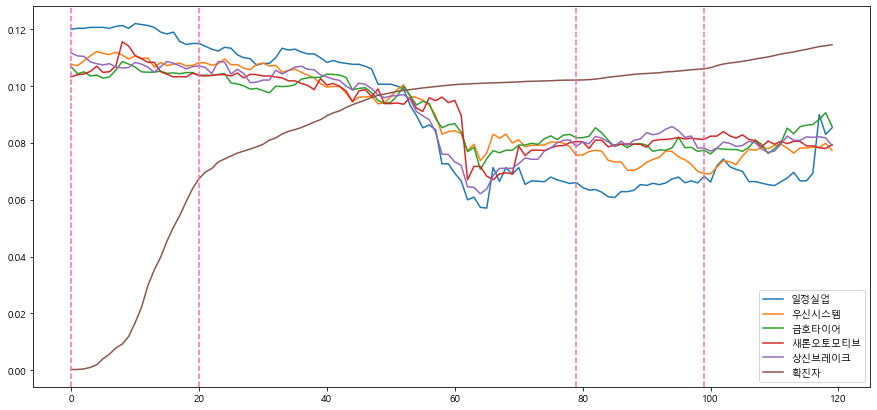


# issue day 구간 별로 확진자와 주가 비교

2월 17일 - 신천지
3월 9일 - 구로 콜센터
5월 7일 - 이태원 클럽
5월 27일 - 쿠팡 부천물류센터


#### 이슈 구간 나누기


```python

corona_specific = corona 
corona_specific['d'] = corona_specific.index

corona_daegu = corona_specific[corona_specific['d'] < 20200308]
corona_guro= corona_specific[corona_specific['d'].apply(lambda x: x>=20200309 and x<=20200329)]
corona_club= corona_specific[corona_specific['d'].apply(lambda x: x>=20200507 and x<=20200527)]
corona_coopang= corona_specific[corona_specific['d'].apply(lambda x: x>=20200527 and x<=20200616)]
```


```python
result_daegu=correlation(combine(corona_daegu, stock_anal))
result_guro=correlation(combine(corona_guro,stock_anal))
result_club=correlation(combine(corona_club,stock_anal))
result_coopang=correlation(combine(corona_coopang,stock_anal))
```

### 1. 대구 코로나 2월 17일 후 20 일 동안


```python
final_daegu=pd.merge(left=result_daegu, right=stock_corona[['회사이름','업종']].drop_duplicates(), on='회사이름') # stock data와 병합

final_daegu=final_daegu[final_daegu['업종']!='없종없음']

positive = final_daegu[final_daegu['상관계수'].apply(lambda x: x >= 0.4)]
negative = final_daegu[final_daegu['상관계수'].apply(lambda x: x <= -0.4)]
```


```python
def top_bar_graph(data,num=1):
    from collections import Counter

    tmp=pd.DataFrame([dict(Counter(data.업종)).keys(), dict(Counter(data.업종)).values()]).T
    tmp.columns=['업종','개수']
    tmp.sort_values(by='개수', ascending=False, inplace=True)
    tmp.reset_index(drop=True, inplace=True)

    bar=plt.bar(tmp.업종, tmp.개수, color='skyblue')
    bar[0].set_color('hotpink')
    bar[1].set_color('pink')

    plt.xticks(rotation=45, fontsize=15)
    plt.yticks(fontsize=15)
    plt.xlim(-1,10.5)
    if num ==1:
        plt.title('양의 상관관계를 가진 상위 업종', fontsize= 20)
    else:
        plt.title('음의 상관관계를 가진 상위 업종', fontsize= 20)
    plt.ylabel('개수', fontsize=15)
    plt.xlabel('업종', fontsize=15)
```


```python
top_bar_graph(positive,1)
```


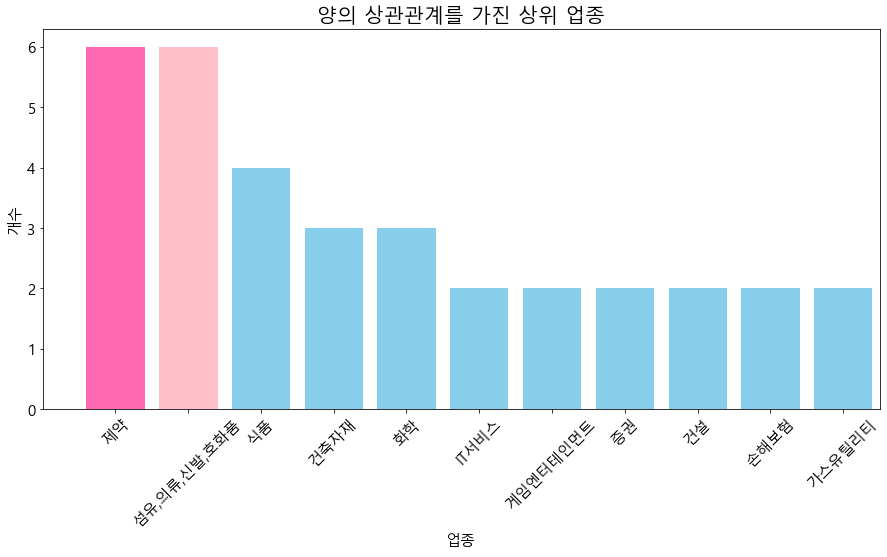


처음에 제조회사가 종목이 꽤 존재한다. 아직 직격탄을 맞지 않은 상태.


```python
top_bar_graph(negative,0)
```


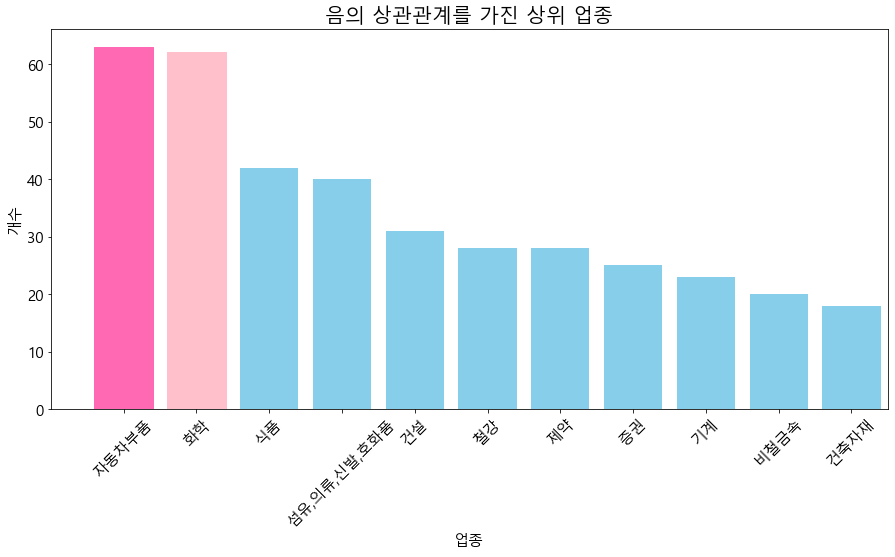


빈도 자체는 음의 상관관계에서 훨씬 많이 존재한다.즉 확진자가 늘수록 주가가 떨어지는 기업이 훨씬 많다는 소리.


### 3월 9일 구로 콜센터 이후 20일간


```python
final_guro=pd.merge(left=result_guro, right=stock_corona[['회사이름','업종']].drop_duplicates(), on='회사이름') # stock data와 병합

final_guro=final_guro[final_guro['업종']!='없종없음']

positive = final_guro[final_guro['상관계수'].apply(lambda x: x >= 0.4)]
negative = final_guro[final_guro['상관계수'].apply(lambda x: x <= -0.4)]
```


```python
top_bar_graph(positive,1)
```


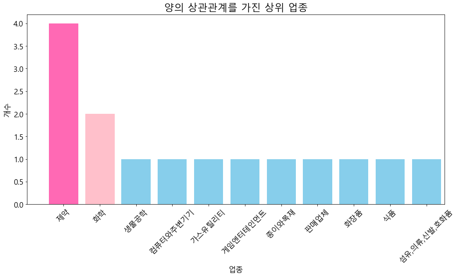


```python
top_bar_graph(negative,0)
```


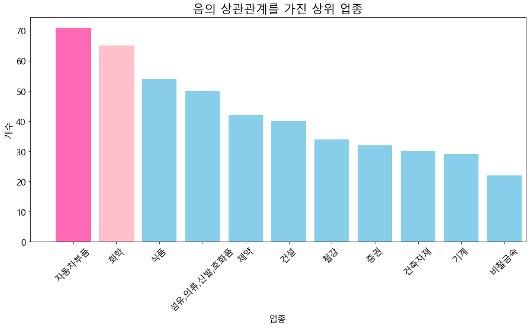


### 3. 5월 7일 이태원 클럽 이후 20일 간


```python
final_club=pd.merge(left=result_club, right=stock_corona[['회사이름','업종']].drop_duplicates(), on='회사이름') # stock data와 병합

final_club=final_club[final_club['업종']!='없종없음']

positive = final_club[final_club['상관계수'].apply(lambda x: x >= 0.4)]
negative = final_club[final_club['상관계수'].apply(lambda x: x <= -0.4)]
```


```python
top_bar_graph(positive,1)
```


```python
top_bar_graph(negative,0)
```


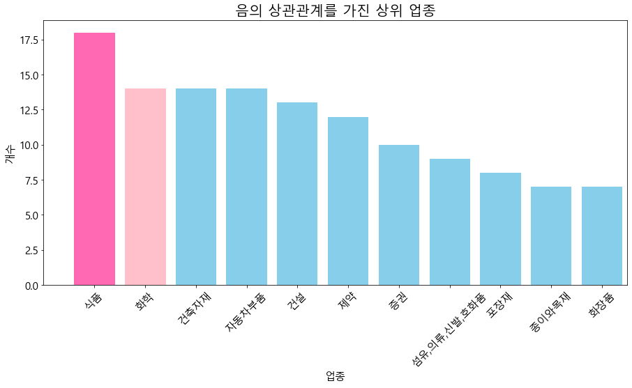


### 4. 5월 27일 쿠팡 물류센터 이후 20일 간


```python
final_coopang=pd.merge(left=result_coopang, right=stock_corona[['회사이름','업종']].drop_duplicates(), on='회사이름') # stock data와 병합

final_coopang=final_coopang[final_coopang['업종']!='없종없음']

positive = final_coopang[final_coopang['상관계수'].apply(lambda x: x >= 0.4)]
negative = final_coopang[final_coopang['상관계수'].apply(lambda x: x <= -0.4)]
```


```python
top_bar_graph(positive,1)
```


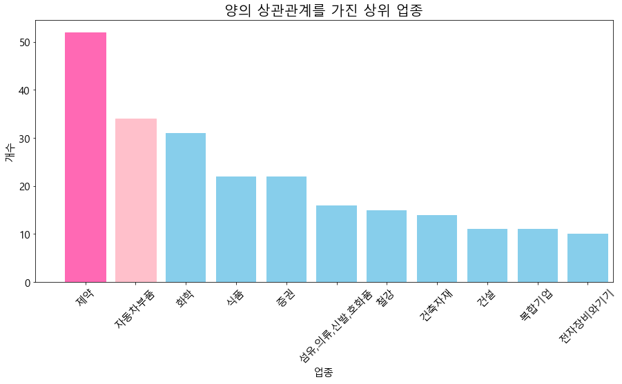


```python
top_bar_graph(negative,0)
```


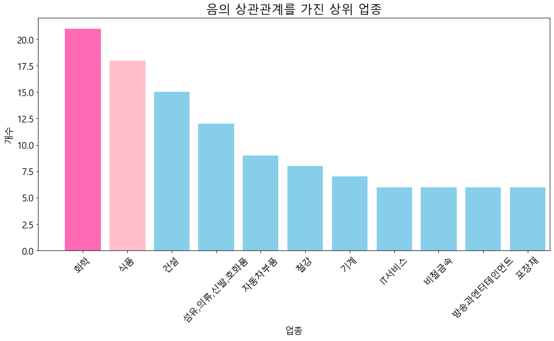


#### 계속해서 양의 상관관계에서 제조업이 2위로 등장하는 이유는 우리나라 산업에서 제조업이 차지하는 비중자체가 크기때문인 것으로 보인다. 양/음 둘다 비교하면 빈도 자체가 음의 상관관계가 높은 회사들이 많다. 

#### 양의 상관관계를 갖는 제조업을 살펴보는 것도 의미가 있어 보인다.


```python
tmp=result_domain[result_domain['업종']=='섬유,의류,신발,호화품']
tmp=tmp[tmp['상관계수']>=0.4]
tmp
```


<div>
<style scoped>
    .dataframe tbody tr th:only-of-type {
        vertical-align: middle;
    }

    .dataframe tbody tr th {
        vertical-align: top;
    }

    .dataframe thead th {
        text-align: right;
    }
</style>
<table border="1" class="dataframe">
  <thead>
    <tr style="text-align: right;">
      <th></th>
      <th>회사이름</th>
      <th>상관계수</th>
      <th>업종</th>
    </tr>
  </thead>
  <tbody>
    <tr>
      <th>48</th>
      <td>국동</td>
      <td>0.677216</td>
      <td>섬유,의류,신발,호화품</td>
    </tr>
    <tr>
      <th>74</th>
      <td>조광피혁</td>
      <td>0.576324</td>
      <td>섬유,의류,신발,호화품</td>
    </tr>
    <tr>
      <th>78</th>
      <td>비티원</td>
      <td>0.564838</td>
      <td>섬유,의류,신발,호화품</td>
    </tr>
    <tr>
      <th>158</th>
      <td>경방</td>
      <td>0.401105</td>
      <td>섬유,의류,신발,호화품</td>
    </tr>
  </tbody>
</table>
</div>


 ### <span style='background:yellow'> 위의 회사들은 왜 확진자가 올라감에도 주가가 상승하였는가?

 ### <span style='background:yellow'> 이 제약회사는 왜 주가가 하락하였는가?


```python
tmp=result_domain[result_domain['업종']=='제약']
tmp=tmp[tmp['상관계수']<=-0.4]
tmp
```


<div>
<style scoped>
    .dataframe tbody tr th:only-of-type {
        vertical-align: middle;
    }

    .dataframe tbody tr th {
        vertical-align: top;
    }

    .dataframe thead th {
        text-align: right;
    }
</style>
<table border="1" class="dataframe">
  <thead>
    <tr style="text-align: right;">
      <th></th>
      <th>회사이름</th>
      <th>상관계수</th>
      <th>업종</th>
    </tr>
  </thead>
  <tbody>
    <tr>
      <th>1069</th>
      <td>일동홀딩스</td>
      <td>-0.407097</td>
      <td>제약</td>
    </tr>
    <tr>
      <th>1182</th>
      <td>한미약품</td>
      <td>-0.473553</td>
      <td>제약</td>
    </tr>
    <tr>
      <th>1431</th>
      <td>유한양행우</td>
      <td>-0.685395</td>
      <td>제약</td>
    </tr>
    <tr>
      <th>1436</th>
      <td>유한양행</td>
      <td>-0.693874</td>
      <td>제약</td>
    </tr>
  </tbody>
</table>
</div>


```python

```
